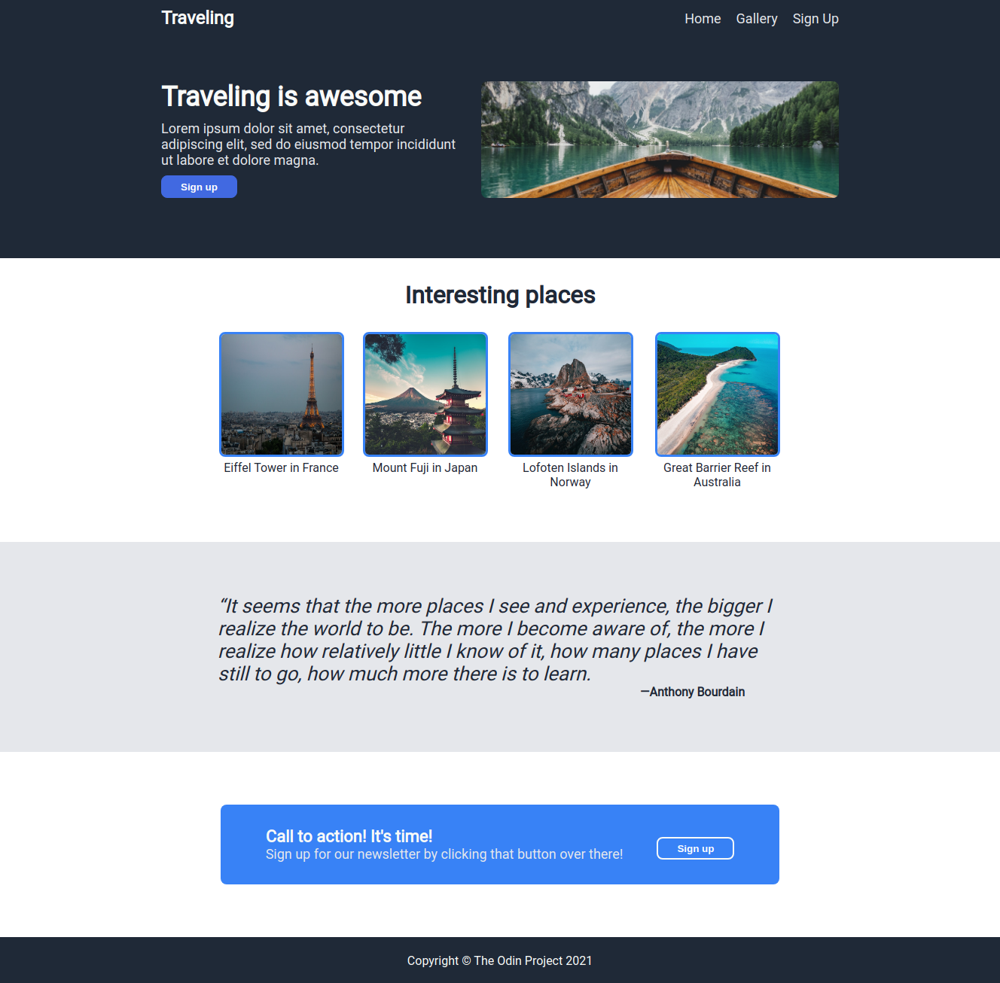
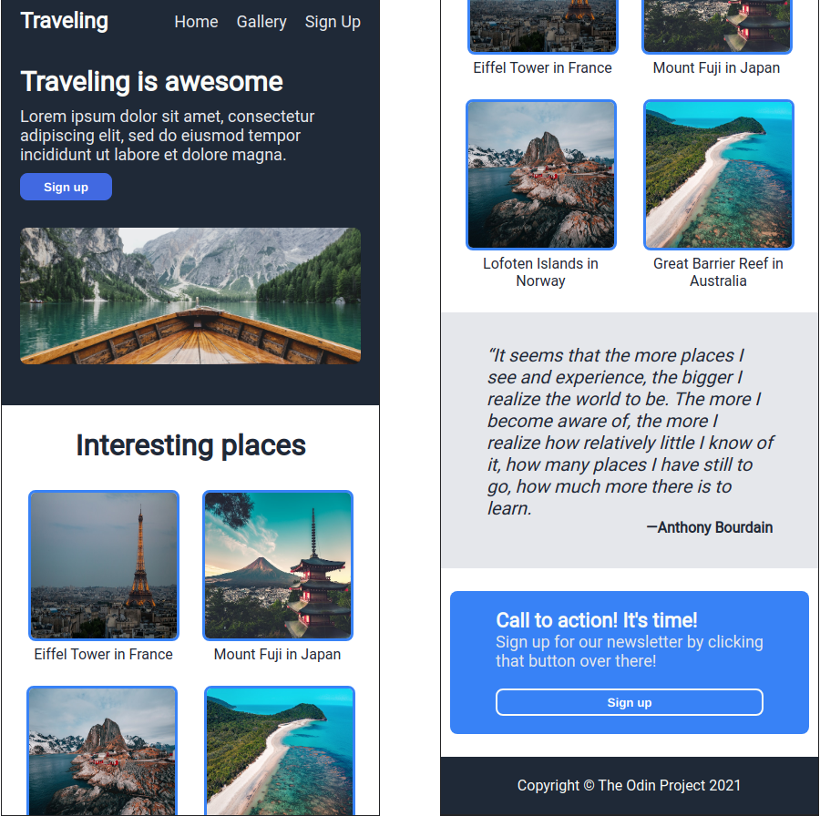

# Odin Project #2: Landing Page

The goal of this Odin Project assignment was to create a simple landing page with HTML and CSS (emphasis on Flexbox).

I started and finished this project in June 2022.

## Assignment

[The Odin Project - Foundations - #2 Landing Page](https://www.theodinproject.com/lessons/foundations-landing-page)

## Technology

- HTML
- CSS

## Key Concepts

- CSS styling
- Flexbox: direction, wrap, gap, justify content and align items

## Links

[Live Demo](https://brightneon7631.github.io/odin-landing-page/)

[My Other Projects](https://brightneon7631.github.io/odin-scrimba-projects/)

## Screenshots

### Desktop



### Mobile



## Sources

- https://unsplash.com/photos/O453M2Liufs by Luca Bravo
- https://unsplash.com/photos/24LIw3veBi4 by Rafael Kellermann
- https://unsplash.com/photos/FuxYvi-hcWQ by Max Bender
- https://unsplash.com/photos/X9TEqJWmM6Q by Manny Moreno
- https://unsplash.com/photos/6f_ANCcbj3o by John O'Nolan
- https://fonts.google.com/specimen/Roboto

## Deployment

```bash
  git clone
```
